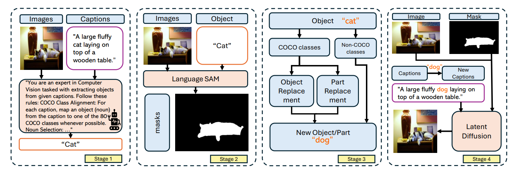
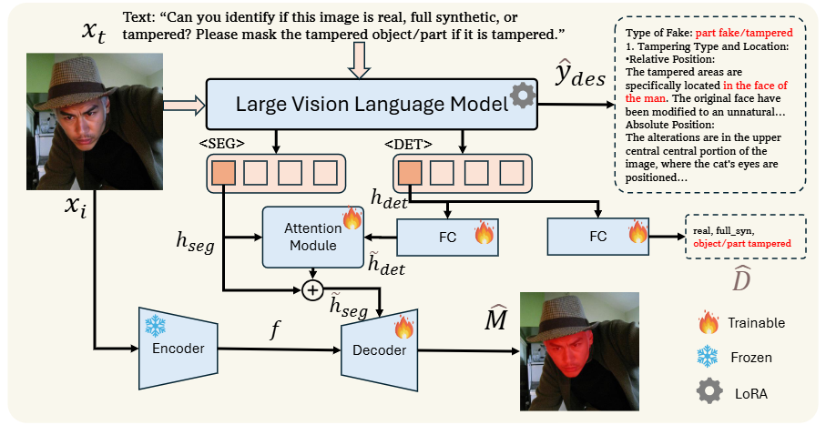
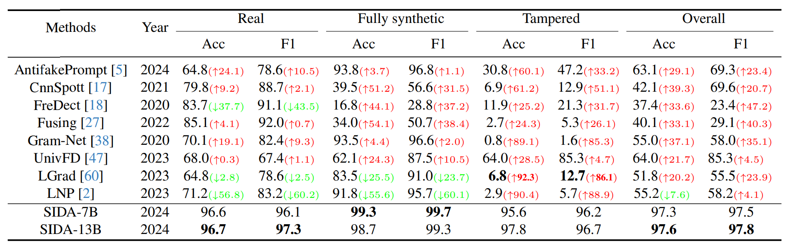
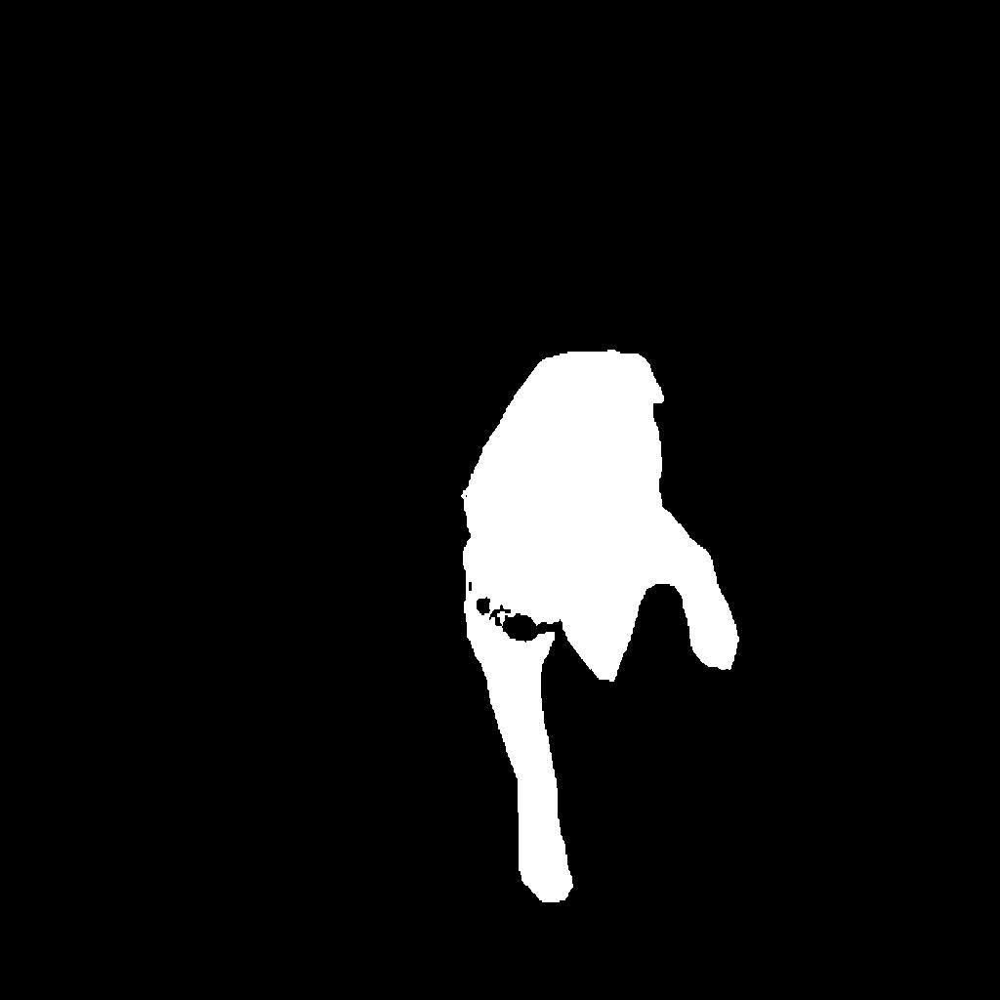
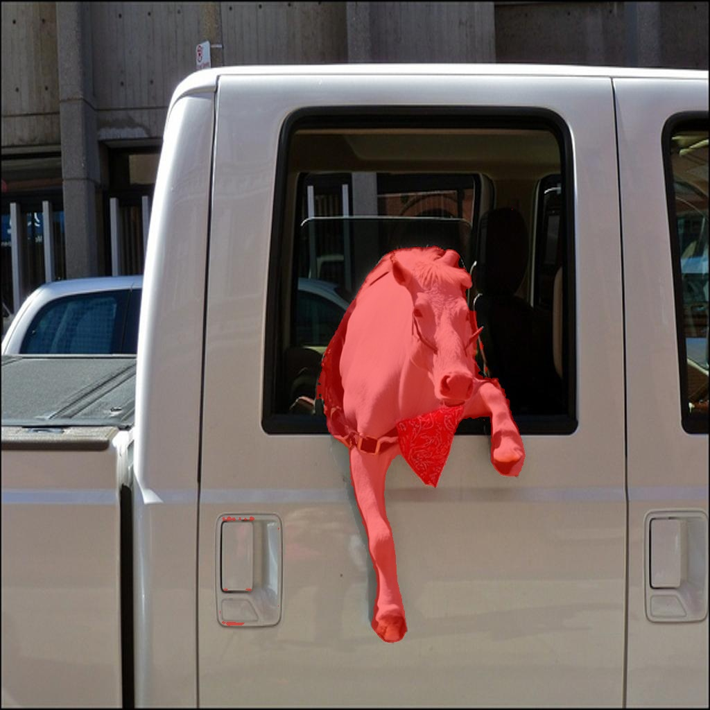
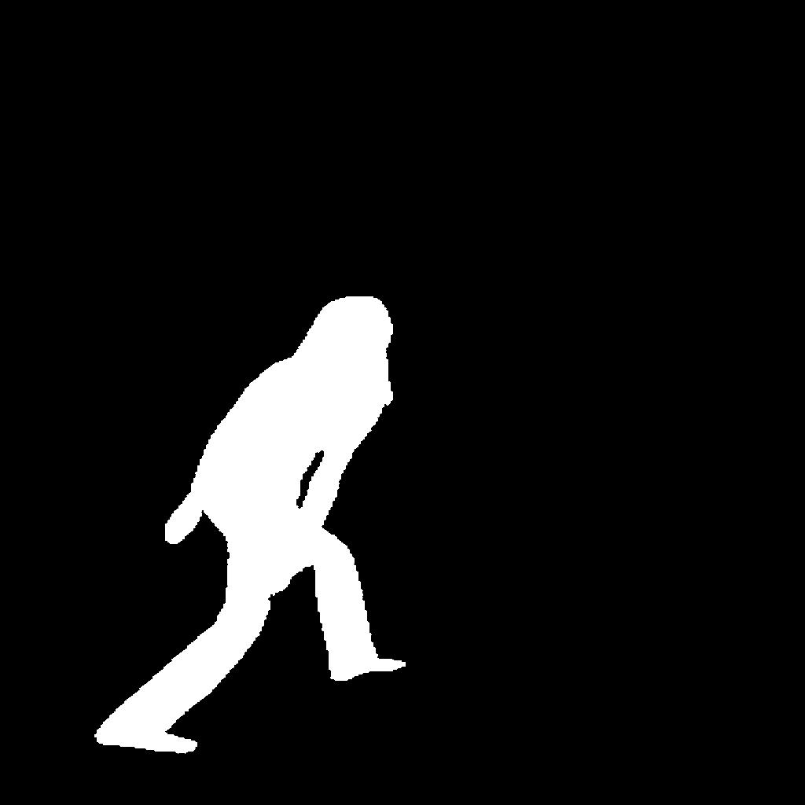
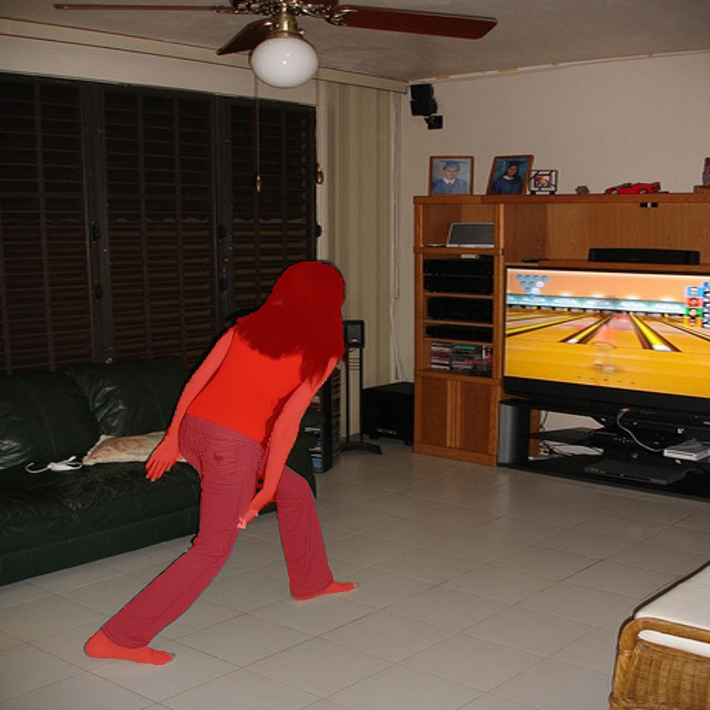
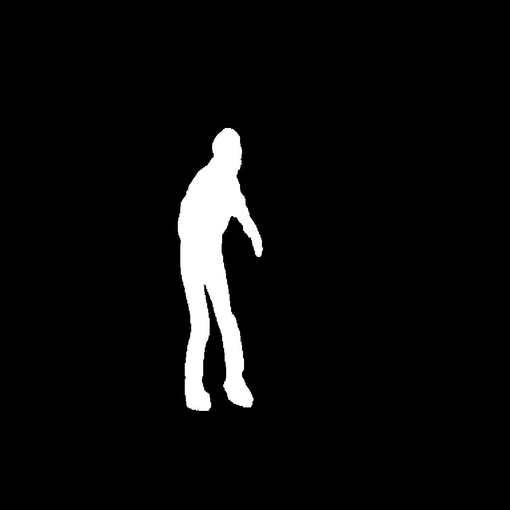
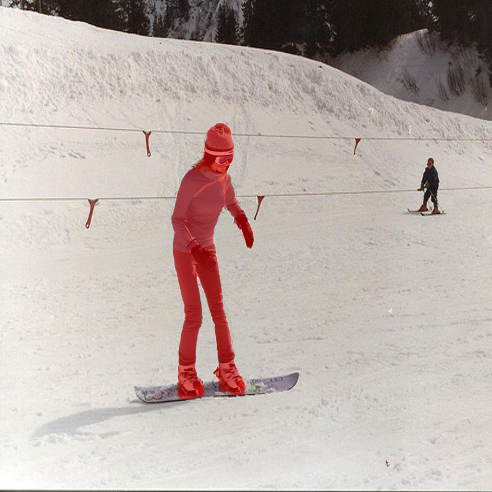

<div align="center">

<h3> SIDA: Social Media Image Deepfake Detection, Localization and Explanation with Large Multimodal Model </h3>

  <p align="center">
    <a href='https://arxiv.org/pdf/2412.04292'>
       </a>
    <a href='https://hzlsaber.github.io/projects/SIDA/' style='padding-left: 0.5rem;'>
       </a>
    <a href='#' style='padding-left: 0.5rem;'>
       </a>
    <a href='#' style='padding-left: 0.5rem;'>
      
    <a href='https://www.youtube.com/watch?v=oAc9BxOoDe8&t=2s' style='padding-left: 0.5rem;'>
       </a>
  </p>
</div>


[Zhenglin Huang](https://scholar.google.com/citations?user=30SRxRAAAAAJ&hl=en&oi=ao), [Jinwei Hu](https://orcid.org/0009-0008-5261-211X), [Xiangtai Li](https://lxtgh.github.io/), [Yiwei He](https://orcid.org/0000-0003-0717-8517), [Xingyu Zhao](https://www.xzhao.me/supervision-teaching)
[Bei Peng](https://beipeng.github.io/), [Baoyuan Wu](https://sites.google.com/site/baoyuanwu2015/home), [Xiaowei Huang](https://cgi.csc.liv.ac.uk/~xiaowei/), [Guangliang Cheng](https://sites.google.com/view/guangliangcheng/homepage)


## Abstract
The rapid advancement of generative models in creating highly realistic images poses substantial risks for misinformation dissemination. For instance, a synthetic image, when shared on social media, can mislead extensive audiences and erode trust in digital content, resulting in severe repercussions.
Despite some progress, academia has not yet created a large and diversified deepfake detection dataset for social media, nor has it devised an effective solution to address this issue. In this paper, we introduce the **Social media Image Detection dataSet (SID-Set)**, which offers three key advantages:
1. **Extensive volume**: Featuring 300K AI-generated/tampered and authentic images with comprehensive annotations.
2. **Broad diversity**: Encompassing fully synthetic and tampered images across various classes.
3. **Elevated realism**: Including images that are predominantly indistinguishable from genuine ones through mere visual inspection.

Furthermore, leveraging the exceptional capabilities of large multimodal models, we propose a new image deepfake detection, localization, and explanation framework, named **SIDA (Social media Image Detection, localization, and explanation Assistant)**. SIDA not only discerns the authenticity of images but also delineates tampered regions through mask prediction and provides textual explanations of the model’s judgment criteria.
Compared with state-of-the-art deepfake detection models on SID-Set and other benchmarks, extensive experiments demonstrate that SIDA achieves superior performance.

## News
- 🔥 The code and dataset are coming soon
- 🔥 (26-02-2025) SIDA has been accepted by CVPR2025! The code and dataset will be released recently.
- 🔥 (16-03-2025) Code release. 
## Methods

<div align="center">
  <figcaption><strong>Figure 1: Generation Process</strong></figcaption>
  
</div>

<div align="center">
  <figcaption><strong>Figure 2: Model Pipeline Overview</strong></figcaption>
  
</div>

## Experiment

<p align="center">  </p>

## Installation

```
pip install -r requirements.txt
```

## Dataset Access

We provide two methods to access the SID_Set dataset:

1. Public Access via Hugging Face
The full training set and validation set are publicly available on [Hugging Face](https://huggingface.co/datasets/saberzl/SID_Set). To load SID_Set, follow the instructions in the [Hugging Face Datasets documentation](https://huggingface.co/docs/datasets/index). You can also explore visual examples directly through the dataset viewer on the platform.

2. Download from Google Drive
Alternatively, you can download the train.zip and validation.zip files for SID_Set from [Google Drive](https://drive.google.com/drive/folders/1sFZxSrDibjpvzTrHeNVS1fTf-qIue744?usp=drive_link). Due to size limitations, we’ve split the train_full_synthetic set into two parts. After downloading, please place both parts in a train/ directory.

For the test set, we provide only a single test.zip file to minimize the risk of data contamination (e.g., from foundation models crawling the test set for training). You can download it [here](https://drive.google.com/file/d/1M2GGCvpg7UDpP6HaHT18-VqzIyD5yhC3/view?usp=drive_link).

## Training
### Training data
To train SIDA, we use the SID_Set dataset. For access to SID_Set, please refer to the Dataset Access section. If you download SID_Set through Google Drive, please organize the files as follows:

```
├── SID_Set
│   ├── train
│   │   └──real
│   │   └──full_synthetic
│   │   └──masks
│   │   └──tampered
│   ├── validation
│   │   ├── real
│   │   ├── full_synthetic
│   │   ├── masks
│   │   └──tampered
```
Note: The existing training code is designed for downloading the SID_Set from Google Drive. If you download datasets from Hugging Face, please refer to the relevant [documentation](https://huggingface.co/docs/datasets/index) for instructions on how to use the dataset.

### Pre-trained weights
SIDA-7B is pretrained on LISA-7B-v1, while SIDA-13B is pretrained on LISA-13B-llama2-v1. To download the corresponding model weights, please refer to the [LISA repository](https://github.com/dvlab-research/LISA). After downloading, place the model weights in the ```/ck``` directory.

### SAM VIT-H weights
Download SAM ViT-H pre-trained weights from the [link](https://dl.fbaipublicfiles.com/segment_anything/sam_vit_h_4b8939.pth).

### Training
```
deepspeed --master_port=24999 train_SIDA.py \
  --version="/path_to/LISA-7B-v1" \
  --dataset_dir='/path_to/SID_Set' \
  --vision_pretrained="/path_to/sam_vit_h_4b8939.pth" \
  --val_dataset="/path_to/SID_Set/"\
  --batch_size=2 \
  --exp_name="SIDA-7B" \
  --epochs=10 \
  --steps_per_epoch=1000 \
  --lr=0.0001 \
```

### Merge LoRA Weight
When training is finished, to get the full model weight:
```
cd ./runs/SIDA-7B/ckpt_model && python zero_to_fp32.py . ../pytorch_model.bin
```

Merge the LoRA weights of `pytorch_model.bin`, save the resulting model into your desired path in the Hugging Face format:
```
CUDA_VISIBLE_DEVICES="" python merge_lora_weights_and_save_hf_model.py \
  --version="PATH_TO_LISA" \
  --weight="PATH_TO_pytorch_model.bin" \
  --save_path="PATH_TO_SAVED_MODEL"
```

For example:
```
CUDA_VISIBLE_DEVICES="" python3 merge_lora_weights_and_save_hf_model.py \
  --version="./ck/LISA-7B-v1" \
  --weight="./runs/SIDA-7B/pytorch_model.bin" \
  --save_path="./ck/SIDA-7B"
```

### Validation
```
deepspeed --master_port=24999 train_SIDA.py \
  --version="PATH_TO_SIDA_HF_Model_Directory" \
  --dataset_dir='/path_to/benchmark' \
  --vision_pretrained="/path_to/sam_vit_h_4b8939.pth" \
  --val_dataset="/path_to/benchmark/"\
  --batch_size=2 \
  --exp_name="SIDA-7B" \
  --eval_only
```

Note: The paper's results were generated using SIDA-7B and SIDA-13B models. To reproduce the experimental results, please use these specific models.

### Inference
To chat with SIDA,  we recommend using SIDA-13B for more accurate segmentation results. To view explanation results, please use SIDA-13B-description.

```
CUDA_VISIBLE_DEVICES=0 python chat_description.py --version='saberzl/SIDA-13B-description'
CUDA_VISIBLE_DEVICES=0 python chat.py --version='saberzl/SIDA-13B'
```

Examples:
```
CUDA_VISIBLE_DEVICES=0 python chat.py --version='saberzl/SIDA-13B'
Please input your prompt: Please answer begin with [CLS] for classification, if the image is  tampered, ouput mask the tampered region. 
Please input the image path: ./examples/figure1.png
text_output:  <s> [CLS] This image is classified as tampered. It has been altered. [SEG] A mask highlighting the tampered region is provided.
```
You should get masked image like below:


## Citation 

```
@misc{huang2025sidasocialmediaimage,
      title={SIDA: Social Media Image Deepfake Detection, Localization and Explanation with Large Multimodal Model}, 
      author={Zhenglin Huang and Jinwei Hu and Xiangtai Li and Yiwei He and Xingyu Zhao and Bei Peng and Baoyuan Wu and Xiaowei Huang and Guangliang Cheng},
      year={2025},
      booktitle={Conference on Computer Vision and Pattern Recognition}
}
```

## Acknowledgement
This work is built upon the [LLaVA](https://github.com/haotian-liu/LLaVA) and [LISA](https://github.com/dvlab-research/LISA).  Much of the documentation in this README is adapted from LISA. We thank the authors for their innovative work!
